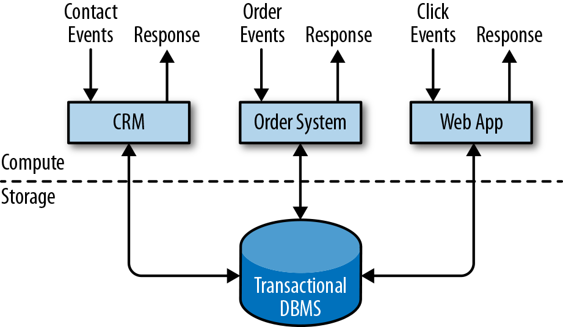

## Flink是什么
* Flink 是一个框架和分布式处理引擎，用于在无边界和有边界数据流上进行有状态的计算。
* Flink 能在所有常见集群环境中运行，并能以内存速度和任意规模进行计算。
* Flink 提供了直观且极富表达力的API来实现有状态的流处理应用。

## 流处理技术概览
### 传统数据处理架构
数十年来，数据和数据处理在企业中无处不在。随着数据采集和使用的不断增长，很多公司已经设计并构建了基础架构来管理数据。大多数企业实施的传统架构区分了两种类型的数据处理：事务处理（OLTP）和分析处理（OLAP）。
#### 事务处理
公司将各种应用程序用于日常业务活动，例如企业资源规划（ERP）系统，客户关系管理（CRM）软件和基于Web的应用程序。这些系统通常设计有单独的层，用于数据处理（应用程序本身）和数据存储（事务数据库系统），如图1-1所示。

应用程序通常连接到外部服务或直接面向用户，并持续处理传入的事件，如网站上的订单，电子邮件或点击。处理事件时，应用程序将会读取远程数据库的状态，或者通过运行事务来更新它。通常，一个数据库系统可以服务于多个应用程序，它们有时会访问相同的数据库或表。

当应用程序需要扩展时，这样的设计可能会导致问题。由于多个应用程序可能会同时用到相同的数据表示，或者共享相同的基础设施，因此想要更改表的结构或扩展数据库，就需要仔细的规划和大量的工作。克服紧耦合应用程序的最新方法是微服务设计模式。微服务被设计为小型、完备且独立的应用程序。他们遵循UNIX的理念，即“只做一件事并且把它做好”。通过将几个微服务相互连接来构建更复杂的应用程序，这些微服务仅通过标准化接口（例如RESTful HTTP连接）进行通信。由于微服务严格地彼此分离并且仅通过明确定义的接口进行通信，因此每个微服务都可以用不同技术栈来实现，包括编程语言、类库和数据存储。微服务和所有必需的软件和服务通常捆绑在一起并部署在独立的容器中。图1-2描绘了一种微服务架构。

#### 分析处理
大量数据存储在公司的各种事务数据库系统中，它们可以为公司业务运营提供宝贵的参考意见。例如，分析订单处理系统的数据，可以获得销量随时间的增长曲线；可以识别延迟发货的原因；还可以预测未来的销量以便提前调整库存。但是，事务数据通常分布在多个数据库中，它们往往汇总起来联合分析时更有价值。而且，数据通常需要转换为通用格式。

所以我们一般不会直接在事务数据库上运行分析查询，而是复制数据到数据仓库。数据仓库是对工作负载进行分析和查询的专用数据存储。为了填充数据仓库，需要将事务数据库系统管理的数据复制过来。将数据复制到数据仓库的过程称为extract-transform-load（ETL）。 ETL过程从事务数据库中提取数据，将其转换为某种通用的结构表示，可能包括验证，值的规范化，编码，重复数据删除（去重）和模式转换，最后将其加载到分析数据库中。 ETL过程可能非常复杂，并且通常需要技术复杂的解决方案来满足性能要求。 ETL过程需要定期运行以保持数据仓库中的数据同步。

将数据导入数据仓库后，可以查询和分析数据。通常，在数据仓库上执行两类查询。第一种类型是定期报告查询，用于计算与业务相关的统计信息，比如收入、用户增长或者输出的产量。这些指标汇总到报告中，帮助管理层评估业务的整体健康状况。第二种类型是即席查询，旨在提供特定问题的答案并支持关键业务决策，例如收集统计在投放商业广告上的花费，和获取的相应收入，以评估营销活动的有效性。两种查询由批处理方式由数据仓库执行，如图1-3所示。

### 流式数据处理架构
#### 状态化流处理
日常生活中，所有数据都是作为连续的事件流创建的。比如网站或者移动应用中的用户交互动作，订单的提交，服务器日志或传感器测量数据：所有这些都是事件流。实际上，很少有应用场景，能一次性地生成所需要的完整（有限）数据集。实际应用中更多的是无限事件流。有状态的流处理就是用于处理这种无限事件流的应用程序设计模式，在公司的IT基础设施中有广泛的应用场景。在我们讨论其用例之前，我们将简要介绍有状态流处理的工作原理。

如果我们想要无限处理事件流，并且不愿意繁琐地每收到一个事件就记录一次，那这样的应用程序就需要是有状态的，也就是说能够存储和访问中间数据。当应用程序收到一个新事件时，它可以从状态中读取数据，或者向该状态写入数据，总之可以执行任何计算。原则上讲，我们可以在各种不同的地方存储和访问状态，包括程序变量（内存）、本地文件，还有嵌入式或外部数据库。

Apache Flink将应用程序状态，存储在内存或者嵌入式数据库中。由于Flink是一个分布式系统，因此需要保护本地状态以防止在应用程序或计算机故障时数据丢失。 Flink通过定期将应用程序状态的一致性检查点（check point）写入远程且持久的存储，来保证这一点。状态、状态一致性和Flink的检查点将在后面的章节中更详细地讨论，但是，现在，图1-4显示了有状态的流式Flink应用程序。

有状态的流处理应用程序，通常从事件日志中提取输入事件。事件日志就用来存储和分发事件流。事件被写入持久的仅添加（append-only）日志，这意味着无法更改写入事件的顺序。写入事件日志的流，可以被相同或不同的消费者多次读取。由于日志的仅附加（append-only）属性，事件始终以完全相同的顺序发布给所有消费者。现在已有几种事件日志系统，其中Apache Kafka是最受欢迎的，可以作为开源软件使用，或者是云计算提供商提供的集成服务。

在Flink上运行的有状态的流处理应用程序，是很有意思的一件事。在这个架构中，事件日志会按顺序保留输入事件，并且可以按确定的顺序重播它们。如果发生故障，Flink将从先前的检查点（check point）恢复其状态，并重置事件日志上的读取位置，这样就可以恢复整个应用。应用程序将重放（并快进）事件日志中的输入事件，直到它到达流的尾部。此技术一般用于从故障中恢复，但也可用于更新应用程序、修复bug或者修复以前发出的结果，另外还可以用于将应用程序迁移到其他群集，或使用不同的应用程序版本执行A / B测试。

如前所述，有状态的流处理是一种通用且灵活的设计架构，可用于许多不同的场景。在下文中，我们提出了三类通常使用有状态流处理实现的应用程序：
* 事件驱动应用程序
* 数据管道应用程序
* 数据分析应用程序

我们将应用程序分类描述，是为了强调有状态流处理适用于多种业务场景；而实际的应用中，往往会具有以上多种情况的特征。
##### 事件驱动应用程序
事件驱动的应用程序是有状态的流应用程序，它们使用特定的业务逻辑来提取事件流并处理事件。根据业务逻辑，事件驱动的应用程序可以触发诸如发送警报、或电子邮件之类的操作，或者将事件写入向外发送的事件流以供另一个应用程序使用。

事件驱动应用程序的典型场景包括：
* 实时推荐（例如，在客户浏览零售商网站时推荐产品）
* 行为模式检测或复杂事件处理（例如，用于信用卡交易中的欺诈检测）
* 异常检测（例如，检测侵入计算机网络的尝试)

事件驱动应用程序是微服务的演变。它们通过事件日志而不是REST调用进行通信，并将应用程序数据保存为本地状态，而不是将其写入外部数据存储区（例如关系数据库或键值数据库）。图1-5显示了由事件驱动的流应用程序组成的服务架构。

图1-5中的应用程序通过事件日志连接。一个应用程序将其输出发送到事件日志通道（kafka），另一个应用程序使用其他应用程序发出的事件。事件日志通道将发送者和接收者分离，并提供异步、非阻塞的事件传输。每个应用程序都可以是有状态的，并且可以本地管理自己的状态而无需访问外部数据存储。应用程序也可以单独处理和扩展。

与事务性应用程序或微服务相比，事件驱动的应用程序具有多种优势。与读写远程数据库相比，本地状态访问提供了非常好的性能。扩展性和容错性都由流处理器来保证，并且以事件日志作为输入源，应用程序的整个输入数据可以可靠地存储，并且可以确定性地重放。此外，Flink可以将应用程序的状态重置为先前的保存点（save point），从而可以在不丢失状态的情况下更新或重新扩展应用程序。

事件驱动的应用程序对运行它们的流处理器有很高的要求，并不是所有流处理器都适合运行事件驱动的应用程序。 API的表现力，以及对状态处理和事件时间支持的程度，决定了可以实现和执行的业务逻辑。这方面取决于流处理器的API，主要看它能提供什么样的状态类型，以及它对事件时间处理的支持程度。此外，精确一次（exactly-once）的状态一致性和扩展应用程序的能力是事件驱动应用程序的基本要求。 Apache Flink符合所有的这些要求，是运行此类应用程序的一个非常好的选择。
##### 数据管道
当今的IT架构包括许多不同的数据存储，例如关系型数据库和专用数据库系统、事件日志、分布式文件系统，内存中的缓存和搜索索引。所有这些系统都以不同的格式和数据结构存储数据，为其特定的访问模式提供最佳性能。公司通常将相同的数据存储在多个不同的系统中，以提高数据访问的性能。例如，网上商店中提供的产品的信息，可以存储在交易数据库中，同时也存储在缓存（如redis）和搜索索引（如ES）中。由于数据的这种复制，数据存储必须保持同步。

在不同存储系统中同步数据的传统方法是定期ETL作业。但是，它们不能满足当今许多场景的延迟要求。另一种方法是使用事件日志（event log）来发布更新。更新将写入事件日志并由事件日志分发。日志的消费者获取到更新之后，将更新合并到受影响的数据存储中。根据使用情况，传输的数据可能需要标准化、使用外部数据进行扩展，或者在目标数据存储提取之前进行聚合。

以较低的延迟，来提取、转换和插入数据是有状态流处理应用程序的另一个常见应用场景。这种类型的应用程序称为数据管道（data pipeline）。数据管道必须能够在短时间内处理大量数据。操作数据管道的流处理器还应具有许多源（source）和接收器（sink）的连接器，以便从各种存储系统读取数据并将数据写入各种存储系统。当然，同样地，Flink完成了所有这些功能。
##### 流式分析
ETL作业定期将数据导入数据存储区，数据的处理是由即席查询（用户自定义查询）或设定好的通常查询来做的。无论架构是基于数据仓库还是基于Hadoop生态系统的组件，这都是批处理。多年来最好的处理方式就是，定期将数据加载到数据分析系统中，但它给分析管道带了的延迟相当大，而且无法避免。

根据设定好的时间间隔，可能需要数小时或数天才能将数据点包含在报告中。我们前面已经提到，数据管道可以实现低延迟的ETL，所以在某种程度上，可以通过使用数据管道将数据导入存储区来减少延迟。但是，即使持续不停地进行ETL操作，在用查询来处理事件之前总会有延迟。虽然这种延迟在过去可能是可以接受的，但是今天的应用程序，往往要求必须能够实时收集数据，并立即对其进行操作（例如，在手机游戏中去适应不断变化的条件，或者在电商网站中提供个性化的用户体验）。

流式分析应用程序不是等待定期触发，而是连续地提取事件流，并且通过纳入最新事件来更新其计算结果，这个过程是低延迟的。这有些类似于数据库中用于更新视图（views）的技术。通常，流应用程序将其结果存储在支持更新的外部数据存储中，例如数据库或键值（key-value）存储。流分析应用程序的实时更新结果可用于驱动监控仪表板（dashboard）应用程序，如图1-6所示。

流分析应用程序最大的优势就是，将每个事件纳入到分析结果所需的时间短得多。除此之外，流分析应用程序还有另一个不太明显的优势。传统的分析管道由几个独立的组件组成，例如ETL过程、存储系统、对于基于Hadoop的环境，还包括用于触发任务（jobs）的数据处理和调度程序。相比之下，如果我们运行一个有状态流应用程序，那么流处理器就会负责所有这些处理步骤，包括事件提取、带有状态维护的连续计算以及更新结果。此外，流处理器可以从故障中恢复，并且具有精确一次（exactly-once）的状态一致性保证，还可以调整应用程序的计算资源。像Flink这样的流处理器还支持事件时间（event-time）处理，这可以保证产生正确和确定的结果，并且能够在很短的时间内处理大量数据。

流分析应用程序通常用于：
* 监控手机网络的质量分析
* 移动应用中的用户行为
* 实时数据的即席分析

#### lambda架构
第一代分布式开源流处理器（2011）专注于具有毫秒延迟的事件处理，并提供了在发生故障时防止事件丢失的保证。这些系统具有相当低级的API，并且对于流应用程序的准确性和结果的一致性，不提供内置支持，因为结果会取决于到达事件的时间和顺序。另外，即使事件没有丢失，也可能不止一次地处理它们。与批处理器相比，第一代开源流处理器牺牲了结果准确性，用来获得更低的延迟。为了让当时的数据处理系统，可以同时提供快速和准确的结果，人们设计了所谓的lambda架构，如图1-7所示。

lambda架构增强了传统的批处理架构，其“快速层”（speed layer）由低延迟的流处理器来支持。数据到达之后由流处理器提取出来，并写入批处理存储。流处理器近乎实时地计算近似结果并将它们写入“快速表”（speed table）。批处理器定期处理批量存储中的数据，将准确的结果写入批处理表，并从速度表中删除相应的不准确结果。应用程序会合并快速表中的近似结果和批处理表中的准确结果，然后消费最终的结果。

lambda架构现在已经不再是最先进的，但仍在许多地方使用。该体系结构的最初目标是改善原始批处理分析体系结构的高延迟。但是，它有一些明显的缺点。首先，它需要对一个应用程序，做出两个语义上等效的逻辑实现，用于两个独立的、具有不同API的处理系统。其次，流处理器计算的结果只是近似的。第三，lambda架构很难建立和维护。

通过在第一代基础上进行改进，下一代分布式开源流处理器（2013）提供了更好的故障保证，并确保在发生故障时，每个输入记录仅对结果产生一次影响（exactly -once）。此外，编程API从相当低级的操作符接口演变为高级API。但是，一些改进（例如更高的吞吐量和更好的故障保证）是以将处理延迟从毫秒增加到几秒为代价的。此外，结果仍然取决于到达事件的时间和顺序。

第三代分布式开源流处理器（2015）解决了结果对到达事件的时间和顺序的依赖性。结合精确一次（exactly-once）的故障语义，这一代系统是第一个具有计算一致性和准确结果的开源流处理器。通过基于实际数据来计算结果（“重演”数据），这些系统还能够以与“实时”数据相同的方式处理历史数据。另一个改进是解决了延迟/吞吐量无法同时保证的问题。先前的流处理器仅能提供高吞吐量或者低延迟（其中之一），而第三代系统能够同时提供这两个特性。这一代的流处理器使得lambda架构过时了。当然，这一代流处理以flink为代表。

除了目前讨论的特性，例如容错、性能和结果准确性之外，流处理器还不断添加新的操作功能，例如高可用性设置，与资源管理器（如YARN或Kubernetes）的紧密集成，以及能够动态扩展流应用程序。其他功能包括：支持升级应用程序代码，或将作业迁移到其他群集或新版本的流处理器，而不会丢失当前状态。

## 流式处理与批处理对比
* 数据时效性不同：流式计算实时，低延迟，批计算非实时，高延迟。
* 数据特征不同：流式计算的数据一般是动态的，没有边界的，而批处理的数据一般则是静态数据。
* 应用场景不同：流式计算应用在实时场景，时效性要求比较高的场景，比如实时推荐，业务监控。。。；批量计算实时性要求不高，离线计算的场景下，数据分析，离线报表等。
* 运行方式不同：流式计算的任务持续进行，批计算任务则一次性完成。

## 适用于流计算的场景
* 物联网（IOT）
    * 传感器实时数据采集和现实，实时报警，交通运输业
* 金融
    * 实时结算和通知推送，实时检测异常行为。
    * 金融机构实时跟踪股市波动，计算风险价值。
* 市场营销
    * 房地产网站跟踪用户移动设备中的一部分数据。
* 电商
* 游戏

## 流计算框架与产品
* IBM InfoSphere Streams\IBM StreamBase
* Strom: Twitter开发的第一代流处理系统
* Heron: Twitter开发的第二代流处理系统
* Apache Storm: 基于Record级别处理数据的流处理引擎，延迟非常低
* Samza: 一种与Apache Kafka消息系统紧密绑定的流处理框架。
* Spark Streaming: 是Spark核心API的一个扩展，可以实现高吞吐量，具备容错机制的实时流数据的处理。

### 主流的流式框架
#### Storm
* 最早使用的流处理框架，社区比较成熟。
* 支持原生流处理，即单事件来处理数据流（所有记录一个接一个处理）。
* 延迟性低（毫秒级）。
* 消息保障能力弱，消息传输可能重复但不会丢失。
* 吞吐量比较低。

#### Spark Streaming
* Spark Streaming属于Spark API的扩展
* 以固定时间间隔（如几秒钟）处理一段段的批处理作业（即微批处理）。
* 延迟性较高（秒级），但能够保证消息传输既不会丢失也不会重复。
* 具有非常高的吞吐。

#### Apache Flink
* 真正的流处理框架（DataFlow Model）.
* 延迟性较低（毫秒级），且能够保证消息传输不会丢失不会重复。
* 具有非常高的吞吐。
* 支持原生流处理。
## 流式处理框架对比
<table>
    <tr><th>框架</th><th>Flink</th><th>Spark Streaming</th><th>Storm</th></tr>
    <tr>
        <td>架构</td>
        <td>架构介于Spark和Storm之间，主从结构与SparkStreaming相似，DataFlow Graph与Storm相似</td>
        <td>架构依赖Spark，主从模式，每个Batch处理都依赖Driver，可以理解为时间维度上的Spark DAG</td>
        <td>主从模式，且依赖ZK，处理过程中对主的依赖不大</td>
    </tr>
    <tr>
        <td>处理模式</td>
        <td>Native</td>
        <td>Micro-batch</td>
        <td>Native</td>
    </tr>
    <tr>
        <td>容错</td>
        <td>高容错机制，基于Chandy-Lamport Distributed Snapshots Checkpoint机制</td>
        <td>WAL及RDD血统机制</td>
        <td>Records ACK</td>
    </tr>
    <tr>
        <td>处理模型与延迟</td>
        <td>单条事件处理，亚秒级延迟</td>
        <td>一个事件窗口内的所有事件。秒级高延迟</td>
        <td>每次传入一个事件，亚秒级低延迟</td>
    </tr>
    <tr>
        <td>吞吐量</td>
        <td>High</td>
        <td>High</td>
        <td>Low</td>
    </tr>
    <tr>
        <td>数据处理保证</td>
        <td>exactly once</td>
        <td>exactly once(Chandy-Lamport,即marker-checkpointer)</td>
        <td>at least one(实现采用record-level acknowledgments), Trident可以支持storm提供exactly once语义</td>
    </tr>
    <tr>
        <td>API</td>
        <td>类库多：机器学习，图分析，关系式数据处理</td>
        <td>能够很容易的对接Spark生态栈里的组件，同时能够对接主流的消息传输组件以及存储系统</td>
        <td>应用需要按照特定的storm定义的规则编写</td>
    </tr>
    <tr>
        <td>易用性</td>
        <td>支持Sql Streaming, Batch和Streaming采用统一编程框架</td>
        <td>支持Sql Streaming, Batch和Streaming采用统一编程框架</td>
        <td>不支持SQL</td>
    </tr>
    <tr>
        <td>成熟性</td>
        <td>新兴项目，处于发展阶段</td>
        <td>已经发展一段时间</td>
        <td>相对较早的流系统，比较稳定</td>
    </tr>
    <tr>
        <td>社区活跃度</td>
        <td>321 contributor</td>
        <td>937 contributor</td>
        <td>216 contributor</td>
    </tr>
    <tr>
        <td>部署性</td>
        <td>jvm</td>
        <td>jvm</td>
        <td>jvm和zk</td>
    </tr>
</table>

## Flink应用场景
* 实时报表
* 流数据分析：决策，推荐，推送
* 实时数仓

## 为什么选择flink
* 统一数据处理组件栈，处理不同类型的数据需求（Batch，Stream, Machine Learning, Graph）
* 支持事件时间（eventTime），接入时间(Ingestion Time)，处理时间(Processing Time)等时间概念。其中事件时间语义能够针对无序事件提供一致，精确的结果。处理时间语义能够用在具有极低延迟需求的应用中。
* 低延迟，高吞吐，精确一次的状态一致性保障，基于轻量级分布式快照实现的容错。
* 分层API
    > 越顶层越抽象，表达含义越简明，使用越方便。

    > 越底层越具体，表达能力越丰富，使用越灵活。

* 连接器：kafka, cassandra, es, jdbc, hdfs
* k8s, YARN, Mesos，高可用，动态扩展，7*24小时全天候运行。
* 支持有状态计算
    * Support for very large state
    * querable state支持
    * 灵活的state-backend
* 支持高度灵活的窗口(window)操作
    * Time Window
        * Tumbling Time Window
        * Sliding Time Window
        * Session Window
    * Count Window
        * Tumbling Count Window
        * Sliding Count Window
* 带反压的连续流模型
* JMX
* 基于JVM实现独立的内存管理
    * Flink在JVM中实现了自己的内存管理。
    * 应用可以超出主内存的大小限制，并且承受更少的垃圾收集的开销。
    * 对象序列化二进制存储，类似于C对内存的管理
