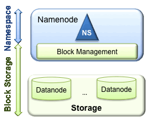
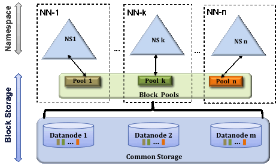

## HDFS

### Introduction

* HDFS是hadoop自带的分布式文件系统，即Hadoop Distributed File System。
* HDFS具有高容错性，部署成本低等特性。
* HDFS提供了对应用数据的高吞吐量访问，适用于大量数据集的应用。
* HDFS放宽了对POXIS的要求，采用流式的数据访问方式。
* HDFS 最初是作为 Apache Nutch 网络搜索引擎项目的基础设施而构建的。
* HDFS现在是Apache Hadoop的主要项目。

### Advantage

* **高容错性**：硬件故障是常态而不是例外。 一个 HDFS 实例可能由数百或数千台服务器组成，每台服务器都会存储一部分数据。 事实上，有大量组件并且每个组件都有很大的故障概率，这意味着 HDFS 的某些组件总是无法正常工作。 因此，故障检测和快速、自动恢复是 HDFS 的核心架构目标。由于 HDFS 采用数据的多副本方案，所以部分硬件的损坏不会导致全部数据的丢失。
* **流式数据访问**：HDFS 更适合批处理而不是用户交互使用，适合一次写入，多次读取。HDFS 设计的重点是支持高吞吐量的数据访问， 而不是低延迟的数据访问。
* **大数据集**：HDFS 适合于大文件的存储，文档的大小应该是是 GB 到 TB 级别的。
* **简单一致性模型**：HDFS 应用程序需要对文件进行一次写入多次读取的访问模型。 文件一旦创建、写入和关闭，除了追加和截断外，无需更改。 支持将内容附加到文件的末尾，但不能在任意点更新。 这种假设简化了数据一致性问题并实现了高吞吐量数据访问。 MapReduce 应用程序或网络爬虫应用程序与此模型完美契合。
* **移动计算比移动数据更容易**：如果应用程序请求的计算在它所操作的数据附近执行，它会更有效率。 当数据集的大小很大时尤其如此。 这最大限度地减少了网络拥塞并增加了系统的整体吞吐量。 假设通常将计算迁移到数据所在的位置，而不是将数据移动到应用程序运行的位置。 HDFS 为应用程序提供了接口，使它们更接近数据所在的位置。
* **跨异构硬件和软件平台的可移植性**：HDFS是使用Java开发的，任何支持java的服务器上都可以部署HDFS，所以HDFS 具有良好的跨平台移植性，这使得其他大数据计算框架都将其作为数据持久化存储的首选方案。

### Architecture

HDFS具有主/从架构，分为管理节点和工作节点。HDFS集群由单个NameNode（管理节点），和多个DataNode（工作节点）构成。

HDFS 公开了一个文件系统命名空间，并允许将用户数据存储在文件中。 在内部，一个文件被分成一个或多个块，这些块存储在一组 DataNode 中。

NameNode主要负责管理文件系统的namespace以及管理Client对文件系统的访问。NameNode 执行文件系统命名空间操作，如打开、关闭和重命名文件和目录。 它还确定块到 DataNode 的映射。 

DataNode主要负责管理连接到它们运行的节点的存储，负责处理来自文件系统客户端的读写请求，根据NameNode的指令执行块的创建、删除和复制。

### Basic Concept

#### Block

HDFS为了支持高效的处理数据，引入了数据块的概念，默认大小128MB（1.X的版本默认是64MB）。HDFS上的文件也被划分为块大小的多个分块（Chunk），作为独立的存储单元。HDFS中小于一个块大小的文件，不会占据整个块的空间（例如，当一个1MB的文件存储在一个128MB的块中，文件只使用1MB的存储空间，而不是128MB）。

引入数据块带来好处：

1. 一个文件的大小可以大于网络中任意一个磁盘的容量，文件的所有块并不需要存储在同一个磁盘里，因此他们可以利用集群上的任意一个磁盘进行存储。
2. 使用抽象块而非整个文件作为存储单元，大大简化了存储子系统的设计。由于块的大小是固定的，因此计算单个磁盘能存储多少个块就相对容易，便于存储管理。此外，块不需要处理文件的元数据（权限等），消除了对元数据的顾虑。
3. 适用于数据备份，提高数据容错力，提高可用性。使用Data Replication。

为什么块的大小不能设置的过大也不能过小（为什么块的大小为128MB?）：

1. HDFS的块比磁盘的块大，其目的是为了最小化寻址开销。
2. 如果块过大，从磁盘传输数据时间会明显大于定位这个块开始位置所需的时间，导致程序在处理这块数据时很慢。
3. 如果块过小，会增加寻址时间，程序会一直寻找块开始的位置。

总结：

传输一个由多个块组成的大文件的时间取决于磁盘传输速率。

#### NameNode & DataNode

**NameNode**是HDFS的管理节点，主要负责的内容有：

1. 管理HDFS的命名空间。
2. 维护文件系统树以及整棵树内所有的文件和目录。
3. 记录每个文件中各个Block所在的DataNode信息。
4. 处理客户端对文件的请求。
5. 配置副本策略。

集群中单一Namenode的结构大大简化了系统的架构。Namenode是所有HDFS元数据的仲裁者和管理者，这样，用户数据永远不会流过Namenode。

**DataNode**是HDFS的工作节点，主要负责的内容有：

1. 存储并检索数据块，受Client或者NameNode调度，进行数据块的创建、删除和复制。
2. 定期向NameNode发送它们所存储的数据块的列表。

没有DataNode，文件系统不会崩溃，文件系统只是无法存储文件，也不会丢失数据。没有NameNode，文件系统会崩溃，文件系统上的所有文件将丢失（无法读出，因为无法定位元数据块的位置，也就无法根据DataNode的块来重构文件）。所以对NameNode实现容错是非常重要的，Hadoop提供了两种机制：

1. 备份组成文件系统元数据持久状态的文件。Hadoop可以通过配置使NameNode在多个FS上保存元数据的持久状态，这些写操作是实时同步的，并且是原子操作。
2. Secondary NameNode：并非NameNode的热备。当NameNode挂掉的时候，它并不能马上替换NameNode并提供服务。其主要作用是定期合并Fsimage和Edits，并推送给NameNode。

#### File System Namespace

HDFS支持传统的层次型文件组织结构。用户或者应用程序可以创建目录，然后将文件保存在这些目录里。文件系统名字空间的层次结构和大多数现有的文件系统类似：用户可以创建、删除、移动或重命名文件。当前，HDFS不支持用户磁盘配额和访问权限控制，也不支持硬链接和软链接。但是HDFS架构并不妨碍实现这些特性。

NameNode负责维护文件系统的名字空间，任何对文件系统名字空间或属性的修改都将被NameNode记录下来。应用程序可以设置HDFS保存的文件的副本数目。文件副本的数目称为文件的副本系数，这个信息也是由NameNode保存的。

#### Block Cache

1. 通常DataNode从磁盘中读取块，但对于访问频繁的文件，其对应的块可能被显式地缓存在DataNode的内存中，以堆外块内存的形式存在。

2. Spark,MapReduce通过在缓存块的DataNode上运行任务，可以利用块缓存的优势提高读操作的性能。

3. 用户或者应用程序可以通过在Cache Pool中增加一个Cache Directive来告诉NameNode需要缓存哪些文件以及存多久。
4. Cache Pool用于管理缓存权限和资源使用。

### HDFS Federation

从整个HDFS系统架构上看，NameNode是其中最重要、最复杂也是最容易出现问题的地方，而且一旦NameNode出现故障，整个Hadoop集群就将处于不可服务的状态，同时随着数据规模和集群规模地持续增长，很多小量级时被隐藏的问题逐渐暴露出来，比如内存将成为系统横向扩展的瓶颈

HDFS 有两个主要层：

- 命名空间（Namespace）
  - 由目录、文件和块组成。
  - 它支持所有与命名空间相关的文件系统操作，如创建、删除、修改和列出文件和目录。
- 块存储服务（Block Storage），它有两个部分：
  - 块管理（在 Namenode 中执行）
    - 通过处理注册和定期心跳来提供 Datanode 集群成员资格。
    - 处理块报告并维护块的位置。
    - 支持创建、删除、修改、获取区块位置等区块相关操作。
    - 管理副本放置、复制不足的块的块复制，并删除复制过度的块。
  - 存储 - 由 Datanodes 通过在本地文件系统上存储块并允许读/写访问来提供。

Namespace管理的元数据除内存常驻外，也会周期Flush到持久化设备上FsImage文件；BlocksMap元数据只在内存中存在；当NameNode发生重启，首先从持久化设备中读取FsImage构建Namespace，之后根据DataNode的汇报信息重新构造BlocksMap。这两部分数据结构是占据了NameNode大部分JVM Heap空间。除了对文件系统本身元数据的管理之外，NameNode还需要维护整个集群的机架及DataNode的信息等信息。为了解决内存限制，单点故障等问题，Hadoop在2.X的发行版中引入Federation，允许HDFS添加多个NameNode，实现横向扩展。

在Federation环境下，每个NameNode维护一个Namespace Volume，由Namespace的元数据和一个Block Pool组成，Block Pool包含该Namespace下文件的所有Block。

Namespace Volume相互独立，两两互不通信，每个Namespace都可以为自己的Block Pool生成Block ID。即使其中一个NameNode挂了也不会影响其他NameNode维护的Namespace的可用性。当这个Namespace/NameNode被删除，其对应的Block Pool也会被删除。

Datanodes 被所有 Namenodes 用作块的公共存储。每个 Datanode 都向集群中的所有 Namenode 注册。Datanodes 定期发送心跳和块报告。它们还处理来自 Namenodes 的命令。

用户可以通过ViewFileSystem和viewfs://URI进行配置和管理。

- 扩展性：NameNode内存使用和元数据量正相关。随着集群规模和业务的发展，即使经过小文件合并与数据压缩，仍然无法阻止内存会成为HDFS横向扩展的瓶颈。
- 可用性：NameNode可以横向扩展，Namespace之间相互独立，即使其中一个NameNode挂了，也不会影响其他NameNode维护的Namespace的可用性。
- 性能：文件系统吞吐量不受单个 Namenode 的限制。向集群添加更多 Namenode 可扩展文件系统读/写吞吐量。
- 隔离性：单个 Namenode 在多用户环境中不提供隔离。例如，实验性应用程序可能会使 Namenode 过载并减慢生产关键应用程序的速度。通过使用多个 Namenode，可以将不同类别的应用程序和用户隔离到不同的命名空间。

### Data Replication

HDFS为了实现容错，所有数据块都会有副本，每个文件的数据块大小和副本数都是可配置的，副本数默认是3，应用程序可以指定某个文件的副本数。副本数可以在文件创建的时候指定，也可以在之后改变。副本如何存放是HDFS可靠性和性能的关键，副本存放策略是HDFS区分于其他大部分分布式文件系统的重要特性。HDFS采用一种称为机架感知(rack-aware)的策略来改进数据的可靠性、可用性和网络带宽的利用率。

#### Rack Awareness & Data Replication Policies

大型HDFS实例一般运行在跨越多个机架的计算机组成的集群上，不同机架上的两台机器之间的通讯需要经过交换机。在大多数情况下，同一个机架内的两台机器间的带宽会比不同机架的两台机器间的带宽大。

通过一个机架感知的过程，Namenode可以确定每个Datanode所属的机架id。一个简单但不是最优的策略就是将副本存放在不同的机架上，这样可以有效防止当整个机架失效时数据的丢失，并且允许读数据的时候充分利用多个机架的带宽。这种策略设置可以将副本均匀分布在集群中，有利于当组件失效情况下的负载均衡。但是，因为这种策略的一个写操作需要传输数据块到多个机架，这增加了写的代价。

HDFS一个优化的存放策略是将一个副本存放在本地机架的节点上，一个副本放在同一机架的另一个节点上，最后一个副本放在不同机架的节点上。这种策略减少了机架间的数据传输，这就提高了写操作的效率。机架的错误远远比节点的错误少，所以这个策略不会影响到数据的可靠性和可用性。于此同时，因为数据块只放在两个（不是三个）不同的机架上，所以此策略减少了读取数据时需要的网络传输总带宽。在这种策略下，副本并不是均匀分布在不同的机架上。三分之一的副本在一个节点上，三分之二的副本在一个机架上，其他副本均匀分布在剩下的机架中，这一策略在不损害数据可靠性和读取性能的情况下改进了写的性能。

#### Replica Selection

为了降低整体的带宽消耗和读取延时，HDFS会尽量让读取程序读取离它最近的副本。如果在读取程序的同一个机架上有一个副本，那么就读取该副本。如果一个HDFS集群跨越多个数据中心，那么客户端也将首先读本地数据中心的副本。

最近节点距离计算：两个节点到达最近的共同祖先的距离总和。

#### Block Placement Policies

如上所述，当复制因子为3时，HDFS的放置策略是，如果写入者在数据节点上，则将一个副本放在本地机器上，否则在与写入者相同机架的随机数据节点上，另一个节点上的副本在不同的（远程）机架中，最后一个在同一远程机架中的不同节点上。如果复制因子大于 3，则随机确定第 4 个及以下副本的放置，同时保持每个机架的副本数量低于上限（基本上是 (replicas - 1) / racks + 2）。除此之外，HDFS 还支持 4 种不同的可插入块放置策略。用户可以根据他们的基础设施和用例选择策略。默认情况下，HDFS 支持 BlockPlacementPolicyDefault。

#### Save Mode

Namenode启动后会进入一个称为安全模式的特殊状态。处于安全模式的Namenode是不会进行数据块的复制的。Namenode从所有的 Datanode接收心跳信号和块状态报告。块状态报告包括了某个Datanode所有的数据块列表。每个数据块都有一个指定的最小副本数。当Namenode检测确认某个数据块的副本数目达到这个最小值，那么该数据块就会被认为是副本安全(safely replicated)的；在一定百分比（这个参数可配置）的数据块被Namenode检测确认是安全之后（加上一个额外的30秒等待时间），Namenode将退出安全模式状态。接下来它会确定还有哪些数据块的副本没有达到指定数目，并将这些数据块复制到其他Datanode上。

### Data Streaming

#### Write

#### Read

### DataNode

### NameNode & Secondary NameNode

### NameNode  HA

### Other

### Shell

### Java API

### Related Documentation

[Hadoop权威指南-第三章](https://book.douban.com/subject/26359169/)

[HDFS官网](https://hadoop.apache.org/docs/stable/hadoop-project-dist/hadoop-hdfs/HdfsUserGuide.html)

[美团对HDFS的应用](https://tech.meituan.com/2017/04/14/hdfs-federation.html)

[尚硅谷大数据](https://www.bilibili.com/video/BV1Qp4y1n7EN)