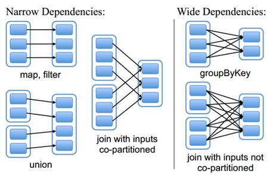
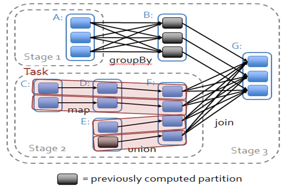

### RDD

#### 什么是RDD

* RDD（Resilient Distributed Dataset）叫做**弹性分布式数据集**，**是Spark中最基本的数据抽象**，它代表一个不可变、可分区、里面的元素可并行计算的集合。
* RDD支持丰富的操作算子。
  * transformation APIs: RDD转换，构建RDD的血缘关系
  * Action APIs:触发RDD的计算并将获取计算结果
* RDD基于血缘关系(Lineage)实现故障重恢复
* RDD数据可缓存到内存中并在多个操作之间共享

#### RDD的特点

- 只读：不能修改，只能通过转换操作生成新的 RDD。
- 分布式：可以分布在多台机器上进行并行处理。
- 弹性：计算过程中内存不够时它会和磁盘进行数据交换。
- 基于内存：可以全部或部分缓存在内存中，在多次计算间重用。

#### RDD的属性

* A list of partitions。一组分片，数据集的基本组成单位。对于RDD来说，每个分片都会被一个计算任务处理，并决定并行计算的粒度。用户可以在创建RDD时指定RDD的分片个数，如果没有指定，那么就会采用默认值。默认值就是程序所分配到的CPU Core的数目。
* A function for computing each split：一个计算每个分区的函数。Spark中RDD的计算是以分片为单位的，每个RDD都会实现compute函数以达到这个目的。compute函数会对迭代器进行复合，不需要保存每次计算的结果。
* A list of dependencies on other RDDs：RDD之间的依赖关系。RDD的每次转换都会生成一个新的RDD，所以RDD之间就会形成类似于流水线一样的前后依赖关系。在部分分区数据丢失时，Spark可以通过这个依赖关系重新计算丢失的分区数据，而不是对RDD的所有分区进行重新计算。
* Optionally, a Partitioner for key-value RDDs (e.g. to say that the RDD is hash-partitioned)：一个Partitioner，即RDD的分片函数。当前Spark中实现了两种类型的分片函数，一个是基于哈希的HashPartitioner，另外一个是基于范围的RangePartitioner。只有对于于key-value的RDD，才会有Partitioner，非key-value的RDD的Parititioner的值是None。Partitioner函数不但决定了RDD本身的分片数量，也决定了parent RDD Shuffle输出时的分片数量。
* Optionally, a list of preferred locations to compute each split on (e.g. block locations for an HDFS file)：一个列表，存储存取每个Partition的优先位置（preferred location）。对于一个HDFS文件来说，这个列表保存的就是每个Partition所在的块的位置。按照“移动数据不如移动计算”的理念，Spark在进行任务调度的时候，会尽可能地将计算任务分配到其所要处理数据块的存储位置。

#### RDD Partition

RDD数据集逻辑上被划分为多个Partition，RDD计算任务在物理上被分配到多个Task。**Partition的数量决定了task的数量，影响着程序的并行度。**Partition是伴生的，也就是说每一种RDD都有其对应的Partition实现。

Partition的子类有：

* JdbcPartition
* HadoopPartition

#### RDD partitioner

决定数据分到哪个Partition，对于非key-value类型的RDD，Partitioner为None， 对应key-value类型的RDD，Partitioner默认为HashPartitioner。在进行shuffle操作时，如reduceByKey, sortByKey，Partitioner决定了父RDD shuffle的输出时对应的分区中的数据是如何进行map的；

前2个函数是所有RDD必须的，后三个可选，所有的RDD均继承了该接口。

Partitioner的子类有：

* HashPartitioner

* RangePartitioner

* 自定义

#### RDD Dependency

由于RDD是粗粒度的操作数据集，每个Transformation操作都会生成一个新的RDD，所以RDD之间就会形成类似流水线的前后依赖关系；RDD和它依赖的父RDD（s）的关系有两种不同的类型，即窄依赖（narrow dependency）和宽依赖（wide dependency）。

**窄依赖：**是指每个父RDD的一个Partition最多被子RDD的一个Partition所使用，例如map、filter、union等操作都会产生窄依赖；（独生子女）

**宽依赖：**是指一个父RDD的Partition会被多个子RDD的Partition所使用，例如groupByKey、reduceByKey、sortByKey等操作都会产生宽依赖；（超生）



（1）图中左半部分join：如果两个RDD在进行join操作时，一个RDD的partition仅仅和另一个RDD中已知个数的Partition进行join，那么这种类型的join操作就是窄依赖，例如图1中左半部分的join操作(join with inputs co-partitioned)；

（2）图中右半部分join：其它情况的join操作就是宽依赖,例如图1中右半部分的join操作(join with inputs not co-partitioned)，由于是需要父RDD的所有partition进行join的转换，这就涉及到了shuffle，因此这种类型的join操作也是宽依赖。

在这里我们是从父RDD的partition被使用的个数来定义窄依赖和宽依赖，因此可以用一句话概括下：如果父RDD的一个Partition被子RDD的一个Partition所使用就是窄依赖，否则的话就是宽依赖。因为是确定的partition数量的依赖关系，所以RDD之间的依赖关系就是窄依赖；由此我们可以得出一个推论：即窄依赖不仅包含一对一的窄依赖，还包含一对固定个数的窄依赖。

一对固定个数的窄依赖的理解：即子RDD的partition对父RDD依赖的Partition的数量不会随着RDD数据规模的改变而改变；换句话说，无论是有100T的数据量还是1P的数据量，在窄依赖中，子RDD所依赖的父RDD的partition的个数是确定的，而宽依赖是shuffle级别的，数据量越大，那么子RDD所依赖的父RDD的个数就越多，从而子RDD所依赖的父RDD的partition的个数也会变得越来越多。



在spark中，会根据RDD之间的依赖关系将DAG图（有向无环图）划分为不同的阶段，对于窄依赖，由于partition依赖关系的确定性，partition的转换处理就可以在同一个线程里完成，窄依赖就被spark划分到同一个stage中，而对于宽依赖，只能等父RDD shuffle处理完成后，下一个stage才能开始接下来的计算。

**因此spark划分stage的整体思路是**：从后往前推，遇到宽依赖就断开，划分为一个stage；遇到窄依赖就将这个RDD加入该stage中。因此在图2中RDD C,RDD D,RDD E,RDDF被构建在一个stage中,RDD A被构建在一个单独的Stage中,而RDD B和RDD G又被构建在同一个stage中。

在spark中，Task的类型分为2种：**ShuffleMapTask**和**ResultTask**；

简单来说，DAG的最后一个阶段会为每个结果的partition生成一个ResultTask，即每个Stage里面的Task的数量是由该Stage中最后一个RDD的Partition的数量所决定的！而其余所有阶段都会生成ShuffleMapTask；之所以称之为ShuffleMapTask是因为它需要将自己的计算结果通过shuffle到下一个stage中；也就是说上图中的stage1和stage2相当于mapreduce中的Mapper,而ResultTask所代表的stage3就相当于mapreduce中的reducer。

在之前动手操作了一个wordcount程序，因此可知，Hadoop中MapReduce操作中的Mapper和Reducer在spark中的基本等量算子是map和reduceByKey;不过区别在于：Hadoop中的MapReduce天生就是排序的；而reduceByKey只是根据Key进行reduce，但spark除了这两个算子还有其他的算子；因此从这个意义上来说，Spark比Hadoop的计算算子更为丰富。

#### RDD 持久化

Spark非常重要的一个功能特性就是可以将RDD持久化在内存中。当对RDD执行持久化操作时，每个节点都会将自己操作的RDD的`partition`持久化到内存中，并且在之后对该RDD的反复使用中，直接使用内存缓存的`partition`。这样的话，对于针对一个RDD反复执行多个操作的场景，就只要对RDD计算一次即可，后面直接使用该RDD，而不需要反复计算多次该RDD。

巧妙使用RDD持久化，甚至在某些场景下，可以将spark应用程序的性能提升10倍。对于迭代式算法和快速交互式应用来说，RDD持久化，是非常重要的。

要持久化一个RDD，只要调用其`cache()`或者`persist()`方法即可。在该RDD第一次被计算出来时，就会直接缓存在每个节点中。而且Spark的持久化机制还是自动容错的，如果持久化的RDD的任何`partition`丢失了，那么Spark会自动通过其源RDD，使用`transformation`操作重新计算该`partition`。

`cache()`和`persist()`的区别在于，`cache()`是`persist()`的一种简化方式，`cache()`的底层就是调用的`persist()`的无参版本，同时就是调用`persist(MEMORY_ONLY)`，将数据持久化到内存中。如果需要从内存中清楚缓存，那么可以使用`unpersist()`方法。

Spark自己也会在`shuffle`操作时，进行数据的持久化，比如写入磁盘，主要是为了在节点失败时，避免需要重新计算整个过程。

持久化级别：

| Storage Level                          | Meaning                                                      |
| -------------------------------------- | ------------------------------------------------------------ |
| MEMORY_ONLY                            | 将RDD作为非序列化的Java对象存储在jvm中。如果RDD不适合存在内存中，一些分区将不会被缓存，从而在每次需要这些分区时都需重新计算它们。这是系统默认的存储级别。 |
| MEMORY_AND_DISK                        | 将RDD作为非序列化的Java对象存储在jvm中。如果RDD不适合存在内存中，将这些不适合存在内存中的分区存储在磁盘中，每次需要时读出它们。 |
| MEMORY_ONLY_SER                        | 将RDD作为序列化的Java对象存储（每个分区一个byte数组）。这种方式比非序列化方式更节省空间，特别是用到快速的序列化工具时，但是会更耗费cpu资源—密集的读操作。 |
| MEMORY_AND_DISK_SER                    | 和MEMORY_ONLY_SER类似，但不是在每次需要时重复计算这些不适合存储到内存中的分区，而是将这些分区存储到磁盘中。 |
| DISK_ONLY                              | 仅仅将RDD分区存储到磁盘中                                    |
| MEMORY_ONLY_2, MEMORY_AND_DISK_2, etc. | 和上面的存储级别类似，但是复制每个分区到集群的两个节点上面   |
| OFF_HEAP (experimental)                | 以序列化的格式存储RDD到[Tachyon](http://tachyon-project.org/)中。相对于MEMORY_ONLY_SER，OFF_HEAP减少了垃圾回收的花费，允许更小的执行者共享内存池。这使其在拥有大量内存的环境下或者多并发应用程序的环境中具有更强的吸引力。 |

NOTE:在python中，存储的对象都是通过Pickle库序列化了的，所以是否选择序列化等级并不重要。

Spark也会自动持久化一些shuffle操作（如`reduceByKey`）中的中间数据，即使用户没有调用`persist`方法。这样的好处是避免了在shuffle出错情况下，需要重复计算整个输入。如果用户计划重用 计算过程中产生的RDD，我们仍然推荐用户调用`persist`方法。

Spark的多个存储级别意味着在内存利用率和cpu利用效率间的不同权衡。我们推荐通过下面的过程选择一个合适的存储级别：

- 如果你的RDD适合默认的存储级别（MEMORY_ONLY），就选择默认的存储级别。因为这是cpu利用率最高的选项，会使RDD上的操作尽可能的快。
- 如果不适合用默认的级别，选择MEMORY_ONLY_SER。选择一个更快的序列化库提高对象的空间使用率，但是仍能够相当快的访问。
- 除非函数计算RDD的花费较大或者它们需要过滤大量的数据，不要将RDD存储到磁盘上，否则，重复计算一个分区就会和重磁盘上读取数据一样慢。
- 如果你希望更快的错误恢复，可以利用重复(replicated)存储级别。所有的存储级别都可以通过重复计算丢失的数据来支持完整的容错，但是重复的数据能够使你在RDD上继续运行任务，而不需要重复计算丢失的数据。
- 在拥有大量内存的环境中或者多应用程序的环境中，OFF_HEAP具有如下优势：
  - 它运行多个执行者共享Tachyon中相同的内存池
  - 它显著地减少垃圾回收的花费
  - 如果单个的执行者崩溃，缓存的数据不会丢失

#### RDD WordCount Code

1. in scala

   ```scala
       val conf = new SparkConf().setAppName("spark-scala-learning").setMaster("local")
       val context = new SparkContext(conf)
       val path = "examples/input/wordcount"
       context.textFile(path).flatMap(_.split(" "))
         .map((_, 1))
         .reduceByKey(_ + _).collect().foreach(println)
   ```

2. in python

   ```python
   print(spark_context.parallelize(data)
         .flatMap(lambda line: line.split(" "))
         .map(lambda word: (word, 1))
         .reduceByKey(lambda a, b: a + b)
         .collect())
   ```

3. in java

   ```java
       String path = "examples/input/wordcount";
       List<Tuple2> results =
           action(
               sparkContext ->
                   sparkContext
                       .textFile(path, sparkContext.defaultMinPartitions())
                       .flatMap(word -> Arrays.asList(word.split(" ")).iterator())
                       .mapToPair(word -> new Tuple2<>(word, 1))
                       .reduceByKey(Integer::sum)
                       .collect());
       results.forEach(System.out::println);
   ```

### 参考文献

https://www.cnblogs.com/qingyunzong/p/8899715.html#_label3_0

https://doc.yonyoucloud.com/doc/spark-programming-guide-zh-cn/programming-guide/rdds/rdd-persistences.html