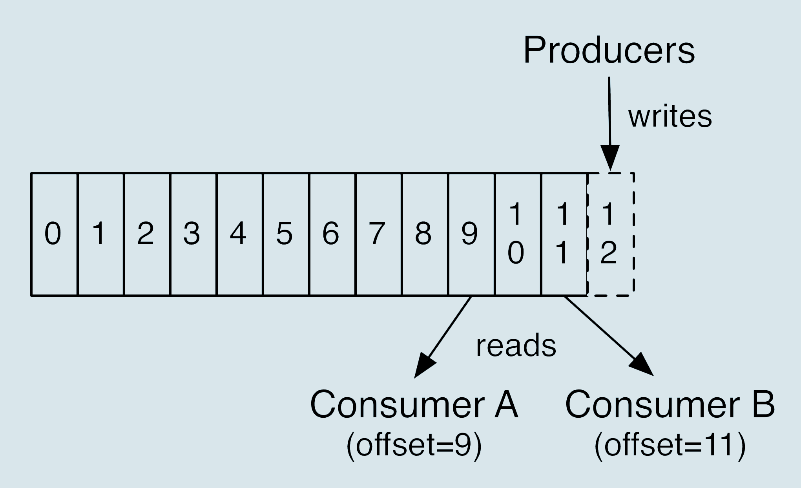

### 消费者和消费者组

#### 概念

**Kafka消费者**对象订阅主题并接收Kafka的消息，然后验证消息并保存结果。**Kafka消费者**是**消费者组**的一部分。一个消费者组里的消费者订阅的是同一个主题，每个消费者接收主题一部分分区的消息。消费者组的设计是对消费者进行的一个横向伸缩，用于解决消费者消费数据的速度跟不上生产者生产数据的速度的问题，通过增加消费者，让它们分担负载，分别处理部分分区的消息。

#### 消费者数目与分区数目

在一个消费者组中的消费者消费的是一个主题的部分分区的消息，而一个主题中包含若干个分区，一个消费者组中也包含着若干个消费者。当二者的数量关系处于不同的大小关系时，Kafka消费者的工作状态也是不同的。看以下三种情况：

1. 消费者数目<分区数目：此时不同分区的消息会被均衡地分配到这些消费者；
2. 消费者数目=分区数目：每个消费者会负责一个分区的消息进行消费；
3. 消费者数目>分区数目：此时会有多余的消费者处于空闲状态，其他的消费者与分区一对一地进行消费。

### 消费者配置

1. fetch.min.bytes:消费者从服务器获取记录的最小字节数。
2. fetch.max.wait.ms
3. max.partition.fetch.bytes：指定了服务器从每个分区里返回给消费者的最大字节数，它的默认值是1MB。比如大于broker能够接收的最大消息的字节数(max.message.bytes)，否则消费者可能无法无法读取这些消息，导致消费者一直挂起重试。
4. session.timeout.ms：与heartbeat.interval.ms紧密相连，一般heartbeat.interval.ms是session.timeout.ms三分之一。
5. auto.offset.reset：latest表示消费者将从最新的记录开始读取，在消费者启动之后生成的记录，默认值。earliest消费者将从起始位置开始读取分区的记录。
6. enable.auto.commit：默认为true，auto.commit.interval.ms控制提交的频率
7. partition.assignment.strategy：Range和RoundRobin
8. client.id
9. max.poll.records
10. receive.buffer.bytes
11. send.buffer.bytes

### 消息丢失

一句话概括，Kafka 只对“已提交”的消息（committed message）做有限度的持久化保证。

这句话里面有两个核心要素，我们一一来看。

第一个核心要素是“已提交的消息”。什么是已提交的消息？当 Kafka 的若干个 Broker 成功地接收到一条消息并写入到日志文件后，它们会告诉生产者程序这条消息已成功提交。此时，这条消息在 Kafka 看来就正式变为“已提交”消息了。那为什么是若干个 Broker 呢？这取决于你对“已提交”的定义。你可以选择只要有一个 Broker 成功保存该消息就算是已提交，也可以是令所有 Broker 都成功保存该消息才算是已提交。不论哪种情况，Kafka 只对已提交的消息做持久化保证这件事情是不变的。

第二个核心要素就是“有限度的持久化保证”，也就是说 Kafka 不可能保证在任何情况下都做到不丢失消息。举个极端点的例子，如果地球都不存在了，Kafka 还能保存任何消息吗？显然不能！倘若这种情况下你依然还想要 Kafka 不丢消息，那么只能在别的星球部署 Kafka Broker 服务器了。现在你应该能够稍微体会出这里的“有限度”的含义了吧，其实就是说 Kafka 不丢消息是有前提条件的。假如你的消息保存在 N 个 Kafka Broker 上，那么这个前提条件就是这 N 个 Broker 中至少有 1 个存活。只要这个条件成立，Kafka 就能保证你的这条消息永远不会丢失。总结一下，Kafka 是能做到不丢失消息的，只不过这些消息必须是已提交的消息，而且还要满足一定的条件。当然，说明这件事并不是要为 Kafka 推卸责任，而是为了在出现该类问题时我们能够明确责任边界。

案例 1：生产者程序丢失数据

Producer 程序丢失消息，这应该算是被抱怨最多的数据丢失场景了。我来描述一个场景：你写了一个 Producer 应用向 Kafka 发送消息，最后发现 Kafka 没有保存，目前 Kafka Producer 是异步发送消息的，也就是说如果你调用的是 producer.send(msg) 这个 API，那么它通常会立即返回，但此时你不能认为消息发送已成功完成。

案例2：消费者程序丢失数据

要对抗这种消息丢失，办法很简单：维持先消费消息，再更新位移的顺序即可。这样就能最大限度地保证消息不丢失。当然，这种处理方式可能带来的问题是消息的重复处理，类似于同一页书被读了很多遍，但这不属于消息丢失的情形。

另外一种隐性的消息丢失情况： Consumer 程序从 Kafka 获取到消息后开启了多个线程异步处理消息，而 Consumer 程序自动地向前更新位移。假如其中某个线程运行失败了，它负责的消息没有被成功处理，但位移已经被更新了，因此这条消息对于 Consumer 而言实际上是丢失了。这里的关键在于 Consumer 自动提交位移，你没有真正地确认消息是否真的被消费就“盲目”地更新了位移。这个问题的解决方案也很简单：如果是多线程异步处理消费消息，Consumer 程序不要开启自动提交位移，而是要应用程序手动提交位移。单个 Consumer 程序使用多线程来消费消息说起来容易，写成代码却异常困难，因为你很难正确地处理位移的更新，也就是说避免无消费消息丢失很简单，但极易出现消息被消费了多次的情况。

### 最佳配置

1. 不要使用 producer.send(msg)，而要使用 producer.send(msg, callback)。记住，一定要使用带有回调通知的 send 方法。
2. 设置 acks = all。acks 是 Producer 的一个参数，代表了你对“已提交”消息的定义。如果设置成 all，则表明所有副本 Broker 都要接收到消息，该消息才算是“已提交”。这是最高等级的“已提交”定义。
3. 设置 retries 为一个较大的值。这里的 retries 同样是 Producer 的参数，对应前面提到的 Producer 自动重试。当出现网络的瞬时抖动时，消息发送可能会失败，此时配置了 retries > 0 的 Producer 能够自动重试消息发送，避免消息丢失。
4. 设置 unclean.leader.election.enable = false。这是 Broker 端的参数，它控制的是哪些 Broker 有资格竞选分区的 Leader。如果一个 Broker 落后原先的 Leader 太多，那么它一旦成为新的 Leader，必然会造成消息的丢失。故一般都要将该参数设置成 false，即不允许这种情况的发生。
5. 设置 replication.factor >= 3。这也是 Broker 端的参数。其实这里想表述的是，最好将消息多保存几份，毕竟目前防止消息丢失的主要机制就是冗余。
6. 设置 min.insync.replicas > 1。这依然是 Broker 端参数，控制的是消息至少要被写入到多少个副本才算是“已提交”。设置成大于 1 可以提升消息持久性。在实际环境中千万不要使用默认值 1。
7. 确保 replication.factor > min.insync.replicas。如果两者相等，那么只要有一个副本挂机，整个分区就无法正常工作了。我们不仅要改善消息的持久性，防止数据丢失，还要在不降低可用性的基础上完成。推荐设置成 replication.factor = min.insync.replicas + 1。确保消息消费完成再提交。
8. Consumer 端有个参数 enable.auto.commit，最好把它设置成 false，并采用手动提交位移的方式。就像前面说的，这对于单 Consumer 多线程处理的场景而言是至关重要的。

